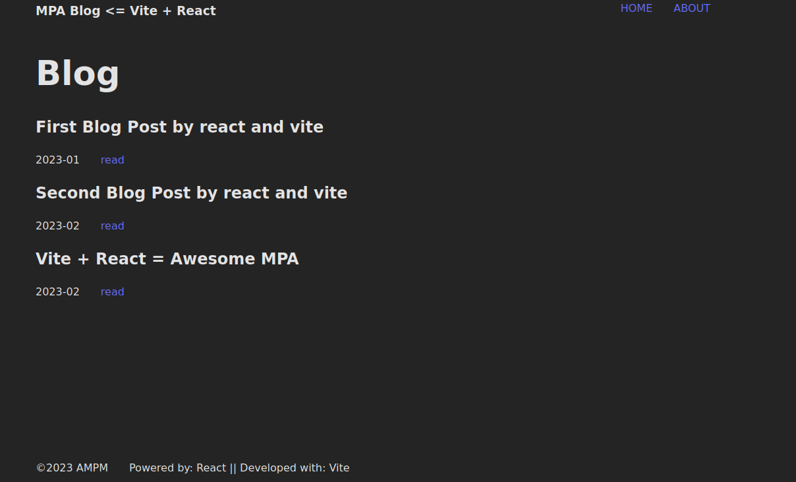
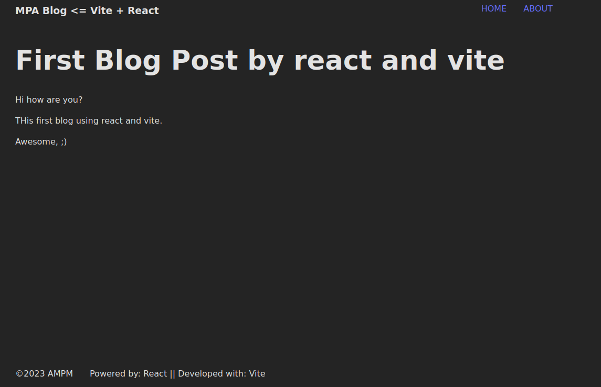

# Vite + React => MPA

A Demo simple blog website, to show MPA (MultiPage App) with React and vite

## Url

[Show me](https://vite-react-mpa-demo.netlify.app/)

## images

home:



detail:



## How run locally

you need:

- node >= 18.13
- npm >= 8-19.3

- just clone the project

- install deps:

```bash
    npm i
```

- run dev server :

```bash
    npm start
```

## How to build the project

```bash
    npm run build
```

### How to preview the project

```bash
    npm run preview
```
